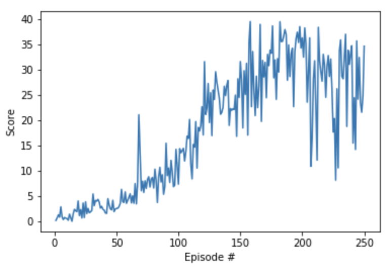

# Project Report

## Learning Algorithm
Reinforcement learning algorithms can be categoized as either **value-based**, **policy-based** or combination of the two. **Value-based** learning consists of learning a state-action value function (*Value/Q-function*) that leads to the **highest-valued state**, by contrast, the **policy-based** approach tries to directly learn a (optimal) policy function directly (without the intermediary *Value/Q-function*).

In the previous [assignment](https://github.com/ZenithSun/Banana_Navigation/blob/master/Report.md) we used a *value-based* algorithm, [Deep Q-Network (DQN)](https://deepmind.com/research/dqn/), to successfuly train an agent to navigate an environment scattered with *good* and *bad* bananas. DQN has seen much success dealing with environments with high-dimensional (complex) states but only dealing with discrete actions. Unfortunately *value-based* algorithms don't scale well when the action space is large, such as when they require a continous output (as its very difficult to converge for large action spaces) such as what is required in this project.  

[**Deep Deterministic Policy Gradient (DDPG)**](https://arxiv.org/pdf/1509.02971.pdf) (the algorithm used in this project) introduces an **actor-critic architecture** to deal with a large action space (continous or discrete). An **actor** is used to tune the parameters 𝜽 for the policy function i.e. decide the best action for a specific state while a **critic** is used to evaluate the policy function estimated by the actor according to the temporal difference (TD) error (*TD learning is a way to learn how to predict a value depending on future values for a given state, similar to Q-Learning*). 
[**Deep Deterministic Policy Gradient (DDPG)**] (the algorithm used in this project) introduces an **actor-critic architecture** to deal with a large action space (continous or discrete). An **actor** is used to tune the parameters 𝜽 for the policy function i.e. decide the best action for a specific state while a **critic** is used to evaluate the policy function estimated by the actor according to the temporal difference (TD) error (*TD learning is a way to learn how to predict a value depending on future values for a given state, similar to Q-Learning*). The combinination of these two networks (Actor and Critic) is a great methodology to control both the **bias** and the **variance** as Value-Based temporal difference(TD) method itself could leads to the large bias, while policy based method itself usually can get large variances.
## Model Architecture and Parameters
- **Actor Network:** 

33(*Observation Input*) -> 128(*fully connected hidden layer1*) -> 

128(*fully connected hidden layer2*) -> 4(*Actions Output*)

- **Critic Network**

33(*Observation Input*) -> 128(*fully connected hidden layer1'*) ->

128(*fully connected hidden layer2‘*) + 4(*Actions Output*) -> 1(*Output*)

- **Hyperparameters**

replay buffer size = 1e5  
minibatch size = 128  
discount factor = 0.99  
tau for soft update of target parameters = 1e-3  
learning rate of the actor = 2e-4  
learning rate of the critic = 2e-4  
L2 weight decay = 0  

## Training Result

The agents were able to solve task in 182 episodes with a final average score of 30.05.

## Future Improvements and Plans
- **Fine Tune Parameters** &mdash;According to the training result chart, we can see after agent solved the task, the average scores goes down again with large variance, which means this agent is not very stable yet. Usually by tuning the parameters such as the number of the time steps to update the critic target network, learning rate etc., we could get a better and more stable result.
- **Try to solve 2nd version project** &mdash; Use methodologies such as PPO, D3PG or D4PG to train 20 agents simultaneously must be fun.
